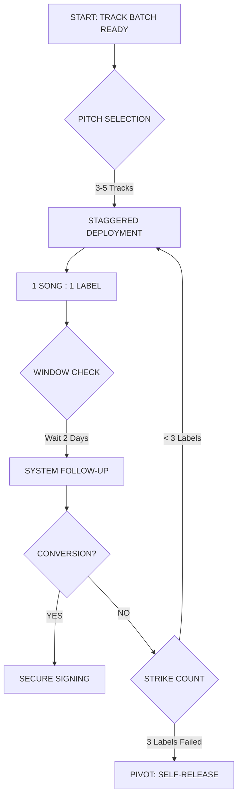

# PROTOCOL: OUTREACH_SEQUENCE_092
> **MISSION:** SECURE RELEASES ON ELITE HOUSE LABELS  
> **TARGETS:** 28 ACTIVE ENTITIES ACQUIRED

This document articulates the sequential beat and tactical flow of the scouting/submission process. It is designed to be a simple, beautiful cycle for consistent label conversion.

---

## 1. THE SEQUENTIAL FLOW

---

## 2. TACTICAL RULES

### **THE PITCH (PHASE 01)**
*   **IF** a track batch is finalized.
*   **THEN** select **3-5 unique tracks** for outreach. 
*   **NOTE:** Never pitch 1 song to multiple labels simultaneously. **Stagger the weight.**

### **THE FOLLOW-UP (THE BEAT)**
*   **IF** 48 hours (2 days) have passed since the last communication.
*   **THEN** trigger a professional follow-up.
*   **WHY?** Maintaining a persistent, professional signal in the noise.

### **THE "3-STRIKE" PIVOT (EXIT PROTOCOL)**
*   **IF** an individual track fails to convert after **3 priority label attempts**.
*   **THEN** re-route that track immediately to the **SELF-RELEASE** pipeline.
*   **GOAL:** Maintain discovery momentum. Never let a track "die" in a drawer.

---

## 3. IF / WHEN LOGIC TABLE

| VARIABLE | CONDITION | PROTOCOL ACTION |
| :--- | :--- | :--- |
| **New Track** | Ready for Demo | Deploy to Target Matrix (Rank 01) |
| **No Response** | T + 48 Hours | Send Follow-Up Protocol |
| **Rejection 01** | Label Decline | Pivot to Target Matrix (Rank 02) |
| **Rejection 03** | Final Decline | Position for Distribution / Self-Release |
| **Signed** | Contract Received | **MISSION ACCOMPLISHED** |

---
*System Check: Sequence loaded. Ready for deployment by Rich Furniss.*
